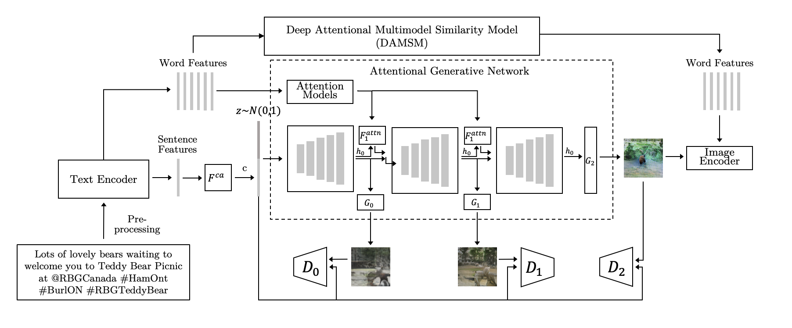

# Text-to-Image Generator -  AttnGAN 


Modified Pytorch implementation for reproducing AttnGAN results in the paper [AttnGAN: Fine-Grained Text to Image Generation
with Attentional Generative Adversarial Networks](http://openaccess.thecvf.com/content_cvpr_2018/papers/Xu_AttnGAN_Fine-Grained_Text_CVPR_2018_paper.pdf) by Tao Xu, Pengchuan Zhang, Qiuyuan Huang, Han Zhang, Zhe Gan, Xiaolei Huang, Xiaodong He. 




## Requirements

    - Python 3.6+
    - Pytorch 1.0+
    - additional Requirements can be found in the requirements.txt

**Pretrained Model**
    - [DAMSM for coco](https://drive.google.com/open?id=1zIrXCE9F6yfbEJIbNP5-YrEe2pZcPSGJ). Download and save it to `DAMSMencoders/`
    - [AttnGAN for coco](https://drive.google.com/open?id=1i9Xkg9nU74RAvkcqKE-rJYhjvzKAMnCi). Download and save it to `models/`


## Application

### Image Generation


**Image Generation**


`/code/05 - new_images_rename`

    - Input  customized txt files in "./data/coco/txt"
    - Input listing of files in "./data/coco/example_filenames.txt" to generate images from customized txt files.  
    
    - Input sentence in "./data/coco/example_captions.txt"  to generate images from customized sentences.


### Transfer generated images

`05 - new_images_rename`

     - script extracts the highest resolutional images from their folders
     - renames them according to their folder
     - saves them in a new directory 
     - from here, the files can be extracted. 


## Reference 


```
@article{Tao18attngan,
  author    = {Tao Xu, Pengchuan Zhang, Qiuyuan Huang, Han Zhang, Zhe Gan, Xiaolei Huang, Xiaodong He},
  title     = {AttnGAN: Fine-Grained Text to Image Generation with Attentional Generative Adversarial Networks},
  Year = {2018},
  booktitle = {{CVPR}}
}
```